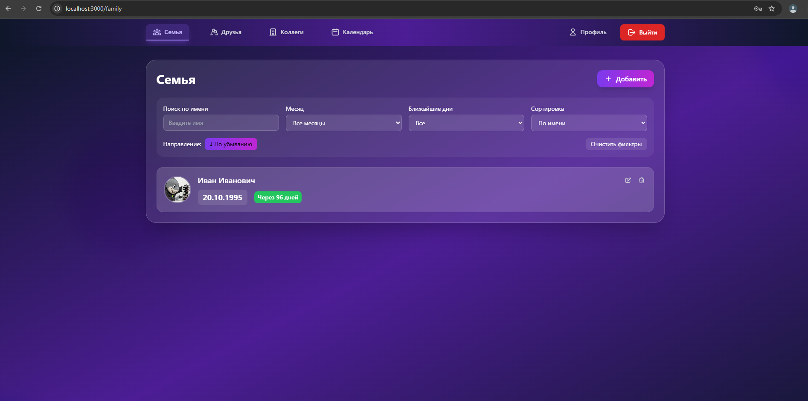
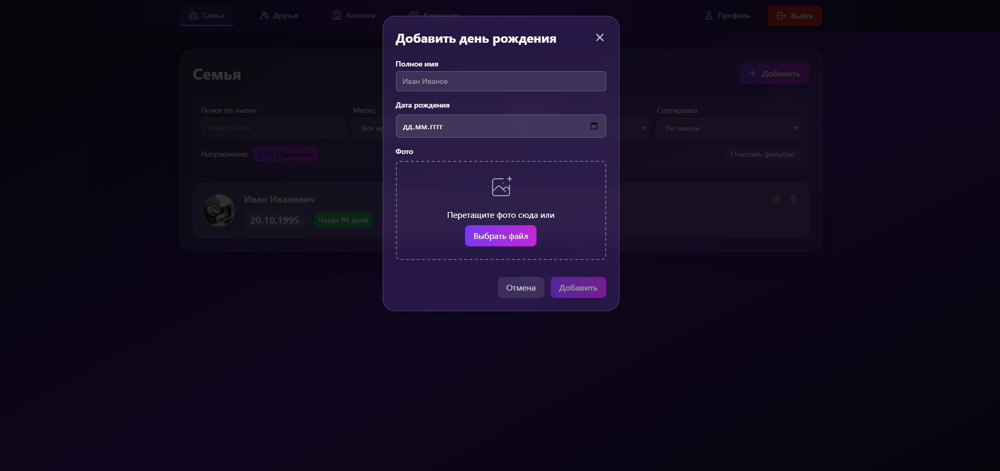
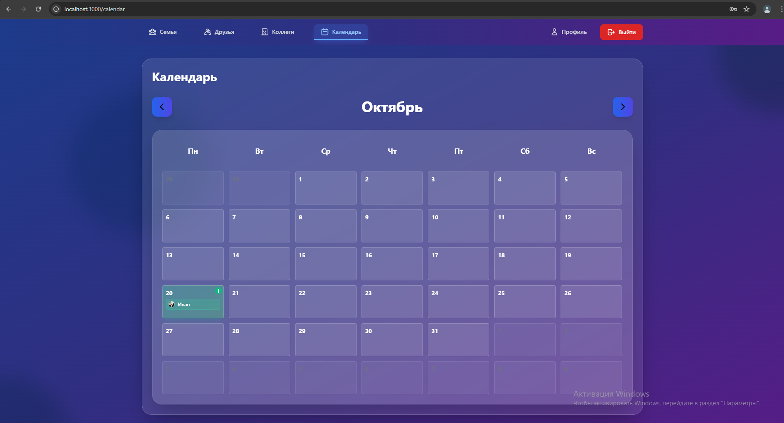
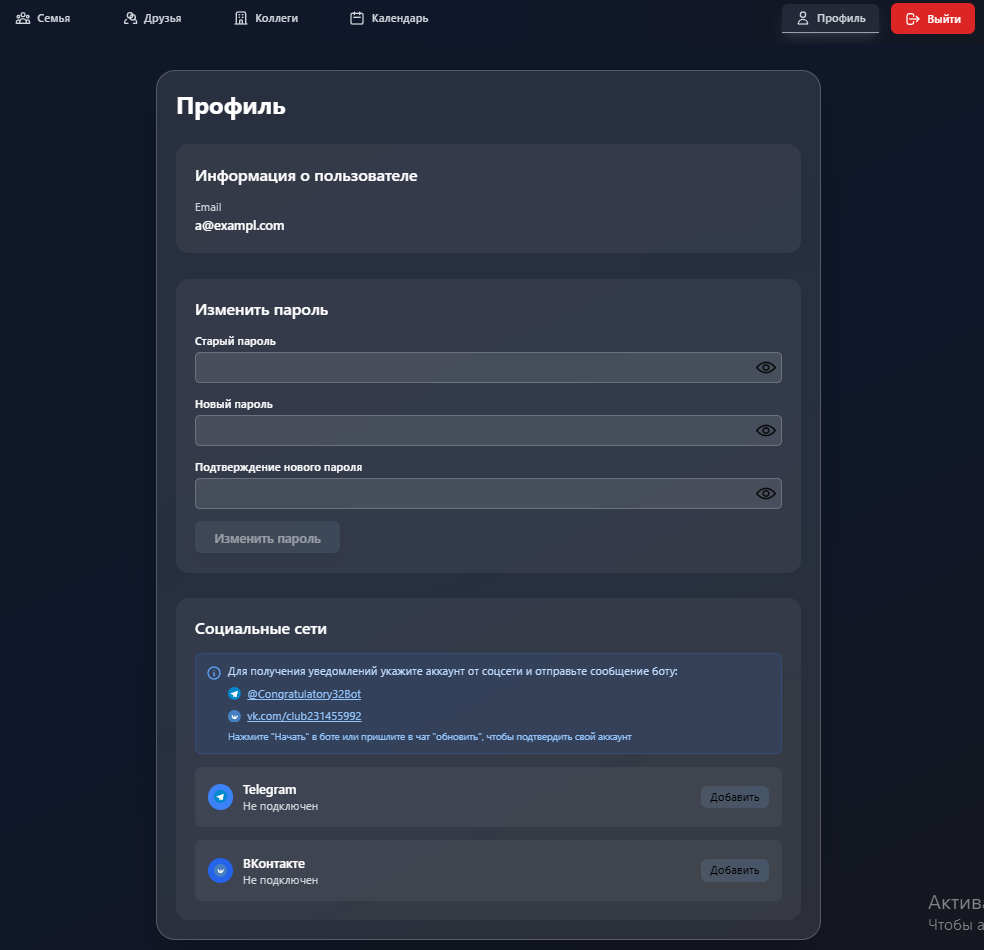

# Поздравлятор

Данный проект разработан в рамках прохождения университетской практики в ООО "Соларлаб".

**Поздравлятор** — это веб-приложение, позволяющее пользователю регистрироваться, добавлять контакты с датами рождения и получать напоминания о предстоящих днях рождения через интерфейс и ботов в Telegram и VK.

---

## Стек технологий

- Backend: ASP.NET Core 8 (REST API + gRPC)
- Frontend: Vue 3
- База данных: PostgreSQL
- Связь с ботами: gRPC
- Контейнеризация: Docker + Docker Compose

---

## Возможности

- Регистрация и авторизация пользователей
- Добавление имен, дат рождения и фотографий
- Подсчёт количества дней до следующего дня рождения
- Календарь с визуализацией дней рождения
- Сортировка и фильтрация контактов
- Интеграция с Telegram и VK (через ботов)
- Возможность включить напоминания через сообщения от ботов
- Полноценный запуск через Docker Compose

---

## Запуск проекта

### 1. Установка Docker и Docker Compose

Убедитесь, что у вас установлены:

- [Docker](https://www.docker.com/)
- [Docker Compose](https://docs.docker.com/compose/)

### 2. Настройка `.env`

Создайте `.env` файл в корне проекта (или используйте предложенный шаблон). Обязательно укажите токены ботов:

```env
# === Kestrel (Backend API) ports ===
Kestrel__HttpPort=80
CONGRATS_API_HTTP_PORT=5000
Kestrel__GrpcPort=5001

# === Backend API URLs ===
CONGRATS_API_HTTP_URL=http://localhost:${CONGRATS_API_HTTP_PORT}
CONGRATS_API_GRPC_URL=http://api.congratulatory:${Kestrel__GrpcPort}

# === JWT ===
JWT_KEY=указать_ключ
JWT_ISSUER=Congratatory
JWT_AUDIENCE=Congratatory

# === Database ===
POSTGRES_DB=Congratulatory
POSTGRES_USER=postgres
POSTGRES_PASSWORD=postgres

# === Telegram Bot ===
TELEGRAM_BOT_TOKEN=указать_токен
TELEGRAM_PORT=7030
TELEGRAM_GRPC_ADDRESS=http://telegram_bot:${TELEGRAM_PORT}

# === VK Bot ===
VK_BOT_TOKEN=указать_токен
VK_PORT=7031
VK_GRPC_ADDRESS=http://vk_bot:${VK_PORT}

# === Frontend URL ===
FRONTEND_PORT=3000
FRONTEND_URL=http://localhost:${FRONTEND_PORT}
```

### Запуск  
Перейдите в корень проекта и выполните:
```bash
docker-compose up --build
```
Приложение автоматически запустит:
- API на http://localhost:5000
- SPA на http://localhost:3000







